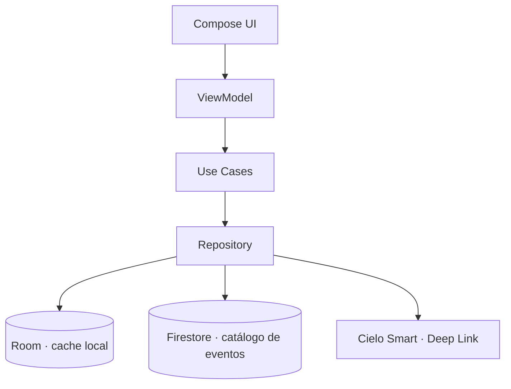
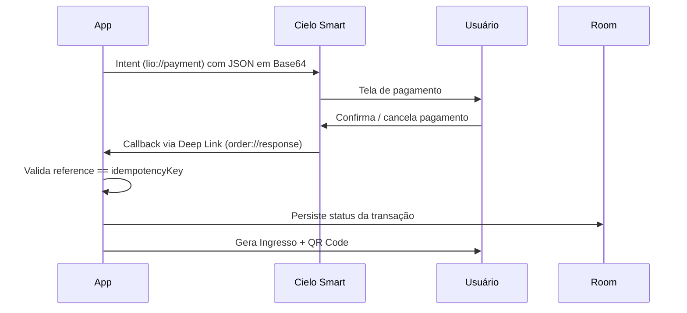
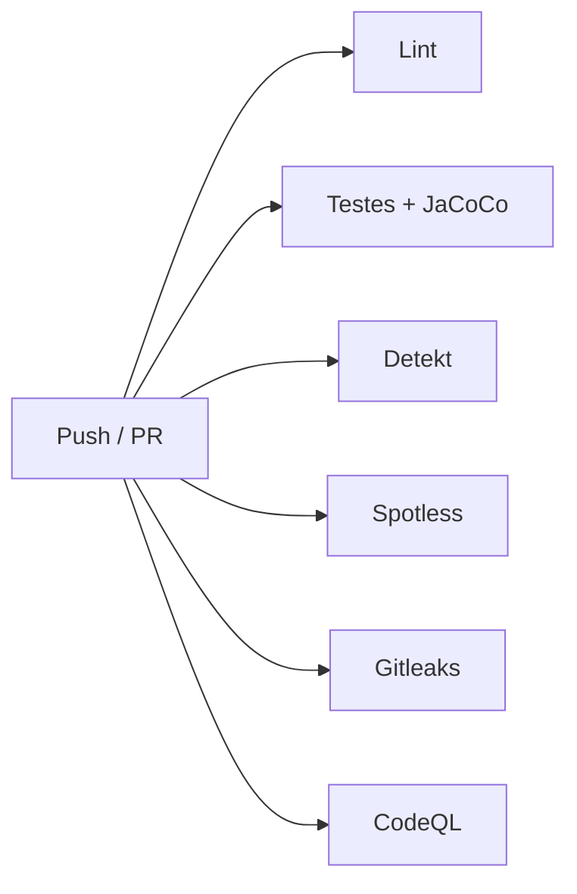

<p align="center">
  
</p>

<p align="center">


</p>

<p align="center">

</p>

<p align="center">
App nativo Android de venda de ingressos para eventos locais, com integração de pagamento via Cielo Smart (Deep Link), desenvolvido como desafio técnico para a vaga de Desenvolvedora Android na Cielo.
</p>

📄 A documentação completa do processo de desenvolvimento assistido por IA (specs, prompts, decisões e resultados) está em [`docs/AI_HARNESS.md`](docs/AI_HARNESS.md).

---

## ✨ Funcionalidades

| | |
|---|---|
| 🎫 | Listagem de eventos disponíveis (Firestore + cache local offline-first) |
| 🔢 | Seleção de quantidade de ingressos por evento |
| 💳 | Pagamento via Deep Link com a Cielo Smart |
| ✅ | Registro do resultado da compra — aprovada, negada, cancelada ou erro |
| 🧾 | Comprovante de compra com **QR Code** vinculado à transação aprovada |
| 📜 | Histórico de ingressos ("Meus Ingressos") |
| 🐛 | Monitoramento de erros técnicos de pagamento via Firebase Crashlytics |
| 🌗 | Tema claro/escuro com paleta gerada a partir da cor de marca da Cielo |
 
---

## 🏗️ Arquitetura

Clean Architecture + **MVI**, organizada em pacotes dentro de um único módulo Gradle (ver [trade-offs](#️-trade-offs-considerados)):



```text
com.cielotickets.app/
├── presentation/   → Compose Screens, ViewModels, contratos MVI (State/Intent/Effect)
├── domain/         → UseCases, modelos de domínio, interfaces de Repository
└── data/           → implementações de Repository, DataSources (Firestore, Room, Cielo Deep Link)
```

> **Por que MVI?** Cada tela expõe um único `State` imutável, `Intents` explícitos por ação do usuário e `Effect`s para eventos de disparo único — dá mais previsibilidade ao fluxo de pagamento, onde o estado assíncrono do callback precisa ser tratado sem ambiguidade.

---

## 💳 Fluxo de Pagamento (Cielo Smart)



A integração usa o modelo **Deep Link** (recomendado pela Cielo em substituição ao SDK descontinuado), sem dependência de biblioteca externa da Cielo.

<details>
<summary><b>🔍 Descoberta durante o desenvolvimento</b> (clique para expandir)</summary>

<br>

A documentação pública da Cielo referencia o pacote `com.ads.lio.uriappclient` como contraparte da integração, mas o pacote real instalado pelo emulador oficial (v1.61.8) é `br.com.cielosmart.orderservice` — provavelmente reflexo do rebranding recente de "LIO" para "Cielo Smart". Identificado via `adb dumpsys package` e corrigido no `AndroidManifest.xml` (`<queries>`).

</details>

---

## 🔒 Prevenção de duplicidade de cobrança

O requisito não-funcional tratado com mais cuidado no projeto:

- ✅ Cada compra recebe uma **chave de idempotência** (UUID) enviada no campo `reference` do JSON de pagamento
- ✅ Antes de gerar uma nova chave, o app **consulta o banco local** por uma compra pendente já existente para o mesmo evento/quantidade — sobrevive a recriação de tela, rotação e processo morto
- ✅ O callback só é aceito se o **`reference` retornado corresponder** à chave da compra atual
- ✅ Antes de criar um `Ticket`, verifica se já existe um para aquela `purchaseReference` — reutiliza em vez de duplicar
- ✅ Status da compra (`PENDING → PAID/DENIED/CANCELLED/ERROR`) persistido para rastreabilidade

---

## 🚀 Como executar

<details open>
<summary><b>Pré-requisitos</b></summary>

<br>

**Obrigatório apenas para rodar e navegar pelo app:**
- Android Studio (versão recente, com KSP2 suportado)
- JDK 17

**Opcional — necessário apenas para testar o fluxo de pagamento de verdade:**
- Conta gratuita no [Portal de Desenvolvedores da Cielo](https://desenvolvedores.cielo.com.br/api-portal/) (integração "Cielo Smart - Order Manager" via Deep Link)
- Emulador Cielo Smart ([download oficial](https://s3-sa-east-1.amazonaws.com/cielo-lio-store/apps/lio-emulator/1.61.8/lio-emulator.apk)) — requer um **AVD dedicado em Android 7 ou Android 10 (API 29)**, separado do AVD de desenvolvimento geral (o emulador da Cielo falha em versões mais novas do Android)

</details>

<details open>
<summary><b>Passo a passo</b></summary>

<br>

```bash
git clone https://github.com/MariaLuiza-CS/Cielo-Tickets.git
```

1. Abra o projeto no Android Studio e aguarde a sincronização do Gradle
2. Rode o app (`Shift+F10`) — **funciona imediatamente**: lista de eventos via Firestore (chave pública já incluída no repositório, protegida por regras de leitura), navegação completa até o checkout
3. Para testar o **pagamento real**: crie um `local.properties` na raiz com
   ```properties
   CIELO_CLIENT_ID=seu_client_id
   CIELO_ACCESS_TOKEN=seu_access_token
   ```
   crie o AVD dedicado (API 29), instale o emulador Cielo Smart, e toque em "Pagar com Cielo Smart" no checkout — sem credenciais configuradas, o app mostra um aviso claro em vez de travar.

</details>

<details>
<summary><b>Comandos úteis</b></summary>

<br>

```bash
./gradlew test                          # testes unitários
./gradlew lint                          # lint Android/Compose
./gradlew detekt                        # complexidade e code smells
./gradlew spotlessCheck                 # valida formatação
./gradlew spotlessApply                 # corrige formatação
./gradlew jacocoTestReport               # relatório de cobertura (HTML)
./gradlew jacocoTestCoverageVerification # valida cobertura mínima (70% no escopo testável)
```

</details>

---

## 📚 Bibliotecas externas

<details>
<summary>Ver tabela completa</summary>

<br>

| Biblioteca | Justificativa |
|---|---|
| Jetpack Compose + Material3 | UI declarativa moderna, padrão atual do Google |
| Hilt | Injeção de dependência com menos boilerplate |
| Coroutines + Flow | Assincronia e streams reativos (essencial no padrão offline-first) |
| Room | Persistência local (cache de eventos, compras pendentes, ingressos) |
| kotlinx.serialization | Serialização dos payloads JSON da Cielo Smart |
| Navigation Compose | Navegação declarativa entre telas |
| Firebase Firestore | Fonte remota do catálogo de eventos (consumo de BaaS, não construção de backend) |
| Firebase Crashlytics | Monitoramento de erros técnicos de pagamento, seguindo recomendação da própria Cielo Smart |
| Coil | Carregamento assíncrono de imagens |
| ZXing (core) | Geração local do QR Code, sem dependência de rede |
| MockK, Turbine, Robolectric, kotlinx-coroutines-test | Stack de testes |
| Detekt · Spotless · JaCoCo | Qualidade estática, formatação e cobertura de testes |

</details>

---

## 🛡️ Qualidade e segurança (CI/SAST)

Pipeline no GitHub Actions a cada push/PR na `main`:



<details>
<summary><b>Incidente de segurança tratado durante o desenvolvimento</b></summary>

<br>

O secret scanning do GitHub identificou a chave de API do Firebase exposta no `google-services.json`. Avaliação: não é credencial privilegiada por design — a proteção real vem das regras do Firestore (leitura pública apenas do catálogo, escrita bloqueada). Mitigação: restrição da chave por API permitida no Firebase Console, mantendo o arquivo público para que qualquer avaliador consiga rodar o projeto sem configuração adicional.

</details>

---

## 🧪 Testes automatizados

Cobertura concentrada nos cenários **críticos**, não amplitude total (decisão documentada abaixo):

- `GeneratePurchaseUseCaseTest` — reuso de chave de idempotência
- `PaymentRepositoryImplTest` — parsing do callback (sucesso, negado, cancelado, erro, malformado)
- `PaymentViewModelTest` — validação de `reference`, prevenção de ticket duplicado
- `EventRepositoryImplTest` — padrão offline-first (Firestore → Room → fallback de cache)
- `TicketRepositoryImplTest`, `GetEventsUseCaseTest`, `GetEventByIdUseCaseTest`, `CreateTicketUseCaseTest`, `GetMyTicketsUseCaseTest`
- `FormattersTest`, `EventMapperTest`, `PaymentCallbackBusTest`
- `EventDetailViewModelTest`, `EventListViewModelTest` — regras de negócio de UI

Relatório de cobertura gerado via JaCoCo, com verificação mínima de **70%** aplicada apenas ao código unitariamente testável (exclui Composables, navegação, DI e classes geradas — ver trade-offs).

---

## ⚖️ Trade-offs considerados

<details>
<summary>Ver decisões e justificativas</summary>

<br>

- **Módulo único vs. multimódulo:** pacotes em um módulo só, dado o prazo de 3 dias, mantendo a mesma disciplina arquitetural.
- **Escopo de testes unitário vs. UI/integrado:** testes de Compose UI via Robolectric foram avaliados, mas descartados por instabilidade de configuração perto do prazo — cobertura unitária forte nos pontos críticos foi priorizada sobre amplitude.
- **`fallbackToDestructiveMigration()` no Room:** aceitável pois o banco local guarda apenas cache recriável e estado transacional de curto prazo.
- **`PaymentResponseActivity` com `exported="true"`:** inerente ao modelo de Deep Link. Mitigado pela validação de `reference` no callback.
- **`google-services.json` público no repositório:** decisão consciente — chave não-privilegiada, protegida pelas regras do Firestore, priorizando que qualquer avaliador rode o projeto sem setup adicional.
- **`@Suppress` pontual em `TooGenericExceptionCaught`/`SwallowedException`** nas fronteiras de rede/parsing: o erro é sempre mapeado para um estado de domínio tratado pela UI.

</details>

---

## 🔮 O que faria com mais tempo

- Migrar para arquitetura **multimódulo** real (`:core`, `:data`, `:domain`, `:feature-events`, `:feature-payment`)
- Testes de Compose UI (instrumentados ou Robolectric estabilizado)
- Sincronização em tempo real do catálogo (listener do Firestore + pull-to-refresh)
- Estratégia de migration real do Room em vez de `fallbackToDestructiveMigration`
- Registro de Estabelecimento Comercial (EC) e testes em Produção/Sandbox real da Cielo
- Comparar Deep Link com a Integração Remota (API Order Manager) como alternativa
- Suporte a mais de um idioma/moeda

---

<p align="center">
  
</p>

